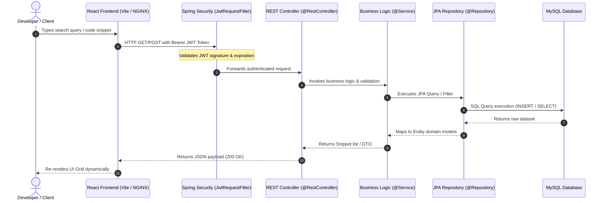

# ⚡ CodeVault: Secure Full-Stack Code Snippet Repository & AI Code Assistant


**CodeVault** is an enterprise-grade, full-stack web application designed for developers to securely store, categorize, search, and optimize code snippets. Built with a **Spring Boot** backend, **MySQL** persistence, **Spring Security (JWT)** stateless authorization, and a **React.js** single-page frontend, the project features **AI-assisted code optimization suggestions** and is fully containerized using **Docker & Docker Compose**.

---

## 🌟 Key Features

- 🔒 **Stateless JWT Security Engine**: Secure user login generating signed JSON Web Tokens (`Authorization: Bearer <token>`). Endpoints are protected so only authenticated users can create or modify snippets, while public read access remains available.
- 🏷️ **Tagging & Keyword Search**: Categorize code snippets by tags (e.g. `sorting`, `arrays`, `trees`). Includes real-time search powered by JPA derived queries searching titles and tags simultaneously.
- 🤖 **AI-Assisted Code Suggestions**: Embedded AI code completion and static analysis module offering instant time/space complexity optimization hints (`O(N)` vs `O(1)` lookups).
- 🐳 **Docker & Docker Compose Orchestration**: Production-ready multi-stage containerization separating Java JRE runtime, static NGINX frontend serving, and persistent MySQL database volumes.
- 🎨 **Modern Dark-Mode UI**: Built with React Hooks (`useState`, `useEffect`) featuring responsive design, glassmorphism card layouts, and tag pill badges.

---

## 🏗️ System Architecture



---

## 🛠️ Technology Stack

| Layer | Technology | Usage / Purpose |
| :--- | :--- | :--- |
| **Backend Framework** | **Java 21 / Spring Boot 3** | REST API development, Dependency Injection, Bean Lifecycle |
| **Security Layer** | **Spring Security & JJWT** | Stateless authentication, JWT token generation & verification |
| **Database & ORM** | **MySQL 8.0 & Spring Data JPA** | Relational data persistence, Hibernate schema mapping |
| **Frontend UI** | **React.js (Vite)** | Reactive single-page application UI, component state management |
| **Styling** | **Vanilla CSS Design System** | Dark mode UI, glassmorphism cards, responsive flex/grid layouts |
| **DevOps & Containerization** | **Docker & Docker Compose** | Multi-stage container builds, NGINX web server, network bridge |

---

## 🔌 API Endpoints Summary

| HTTP Method | Endpoint | Access Level | Description |
| :--- | :--- | :--- | :--- |
| `POST` | `/api/auth/login` | **Public** | Authenticates credentials and returns JWT Bearer Token |
| `GET` | `/api/snippets` | **Public** | Retrieves all code snippets (supports `?search=keyword`) |
| `GET` | `/api/snippets/{id}` | **Public** | Retrieves single snippet by unique primary key |
| `POST` | `/api/snippets` | **Secured (JWT)** | Creates a new code snippet with tags and code content |
| `DELETE` | `/api/snippets/{id}` | **Secured (JWT)** | Deletes code snippet by ID |

---

## 🚀 Quick Start Guide

### Option 1: Run with Docker Compose (Recommended - 1 Command)

Ensure [Docker Desktop](https://www.docker.com/products/docker-desktop/) is running on your system, then execute:

```bash
# Clone the repository
git clone https://github.com/YOUR_USERNAME/CodeVault.git
cd CodeVault

# Build and start all 3 containers (MySQL, Spring Boot, React)
docker compose up --build
```

Access the application in your browser:
- 🌐 **React Frontend**: `http://localhost:5173`
- ⚙️ **Spring Boot Backend**: `http://localhost:8080`
- 🗄️ **MySQL Database**: `localhost:3307`

---

### Option 2: Run Locally (Without Docker)

#### 1. Start Spring Boot Backend
```bash
cd codevault-backend
./mvnw spring-boot:run
```

#### 2. Start React Frontend
```bash
cd codevault-frontend
npm install
npm run dev
```

---

## 🔐 Credentials for Testing

To test authenticated endpoints (`POST /api/snippets`), use the default admin credentials:
- **Username:** `admin`
- **Password:** `password123`

---

## 🛡️ Interview Talking Points

- **Layered Architecture:** Follows separation of concerns (`Controller` $\rightarrow$ `Service` $\rightarrow$ `Repository` $\rightarrow$ `Database`).
- **Stateless Authentication:** Explains JWT bearer token usage over HTTP sessions for scalable microservices readiness.
- **AI Integration Contract:** Demonstrates client-side AI code optimization interfaces with heuristic fallback for offline resilience.
- **Production DevOps:** Utilizes multi-stage Dockerfiles (`Temurin JRE 21` runtime for backend and `NGINX Alpine` serving built static frontend assets).
